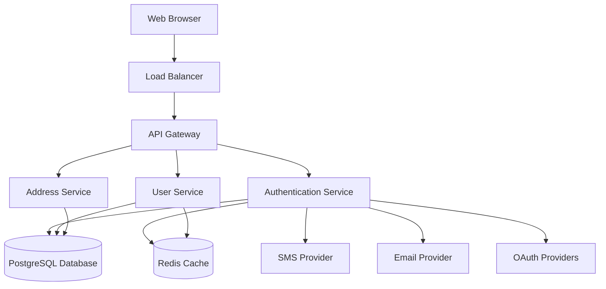

# Design Document

## Overview

The African E-commerce Web Application is a full-stack web platform designed to facilitate online commerce across six African countries: Nigeria, Ghana, Kenya, South Africa, Cameroon, and Egypt. The system supports dual user roles (Buyer and Vendor) with flexible authentication methods and region-specific address handling.

### Technology Stack

- **Frontend**: React.js with TypeScript for type safety
- **Backend**: Node.js with Express.js
- **Database**: PostgreSQL for relational data with PostGIS extension for geographic data
- **Authentication**: JWT tokens with OAuth 2.0 integration for social login
- **SMS Service**: Twilio or Africa's Talking for SMS verification
- **Email Service**: SendGrid or AWS SES
- **Hosting**: Cloud-based (AWS, Azure, or Google Cloud)

## Architecture

### High-Level Architecture



### Service Architecture

The application follows a microservices-inspired modular monolith architecture:

1. **Authentication Service**: Handles user registration, login, session management, and OAuth integration
2. **User Service**: Manages user profiles, roles, and account settings
3. **Address Service**: Handles country-specific address validation and storage
4. **Notification Service**: Manages email and SMS notifications

## Components and Interfaces

### Frontend Components

#### Authentication Module

**Components:**
- `RegistrationForm`: Multi-step registration with authentication method selection
- `LoginForm`: Login interface with multiple authentication options
- `SocialAuthButtons`: WhatsApp and Facebook OAuth integration
- `PhoneVerification`: SMS code input and verification
- `EmailVerification`: Email verification flow
- `PasswordReset`: Password recovery interface

**State Management:**
- User authentication state (logged in/out, user data)
- Registration flow state (current step, selected auth method)
- Form validation state

#### User Profile Module

**Components:**
- `ProfileDashboard`: Main profile view with editable fields
- `RoleSelector`: Buyer/Vendor role management
- `AddressManager`: Address CRUD interface with country-specific forms
- `SecuritySettings`: Password change and session management
- `VerificationStatus`: Vendor verification badge and status display

#### Address Module

**Components:**
- `CountrySelector`: Dropdown for country selection
- `DynamicAddressForm`: Renders country-specific address fields
- `AddressList`: Displays saved addresses with edit/delete actions
- `AddressValidation`: Real-time validation feedback

### Backend API Endpoints

#### Authentication Endpoints

```
POST   /api/auth/register/email
POST   /api/auth/register/phone
POST   /api/auth/register/social
POST   /api/auth/verify/email
POST   /api/auth/verify/phone
POST   /api/auth/login
POST   /api/auth/logout
POST   /api/auth/refresh
POST   /api/auth/password/reset-request
POST   /api/auth/password/reset
GET    /api/auth/sessions
DELETE /api/auth/sessions/:sessionId
```

#### User Endpoints

```
GET    /api/users/profile
PUT    /api/users/profile
PATCH  /api/users/role
GET    /api/users/verification-status
POST   /api/users/verification-request
DELETE /api/users/account
```

#### Address Endpoints

```
GET    /api/addresses
POST   /api/addresses
PUT    /api/addresses/:id
DELETE /api/addresses/:id
PATCH  /api/addresses/:id/set-primary
GET    /api/addresses/regions/:country
```

### API Request/Response Formats

#### Registration Request (Email)
```json
{
  "email": "user@example.com",
  "password": "SecurePass123!",
  "role": ["buyer"],
  "acceptedTerms": true
}
```

#### Registration Response
```json
{
  "success": true,
  "userId": "uuid",
  "message": "Verification email sent",
  "requiresVerification": true
}
```

#### Address Creation Request
```json
{
  "country": "Nigeria",
  "state": "Lagos",
  "lga": "Ikeja",
  "city": "Ikeja",
  "streetAddress": "123 Main Street",
  "postalCode": "100001",
  "isPrimary": true
}
```

## Data Models

### User Model

```typescript
interface User {
  id: string;                    // UUID
  email?: string;                // Optional for social auth
  phoneNumber?: string;          // Optional for social auth
  passwordHash?: string;         // Null for social auth only
  roles: UserRole[];             // ['buyer', 'vendor']
  authProvider: AuthProvider;    // 'email' | 'phone' | 'whatsapp' | 'facebook'
  emailVerified: boolean;
  phoneVerified: boolean;
  verificationStatus: VerificationStatus; // 'unverified' | 'pending' | 'verified'
  createdAt: Date;
  updatedAt: Date;
  lastLoginAt: Date;
  isActive: boolean;
}
```

### Address Model

```typescript
interface Address {
  id: string;                    // UUID
  userId: string;                // Foreign key to User
  country: SupportedCountry;     // 'Nigeria' | 'Ghana' | 'Kenya' | 'South Africa' | 'Cameroon' | 'Egypt'
  region: string;                // State/Province/County/Governorate
  subRegion?: string;            // LGA/District/Sub-County/Municipality/Division
  city: string;
  district?: string;             // For Egypt
  streetAddress: string;
  postalCode?: string;
  isPrimary: boolean;
  createdAt: Date;
  updatedAt: Date;
}
```

### Session Model

```typescript
interface Session {
  id: string;                    // UUID
  userId: string;                // Foreign key to User
  token: string;                 // JWT token hash
  deviceInfo: string;            // User agent
  ipAddress: string;
  expiresAt: Date;
  createdAt: Date;
  lastActivityAt: Date;
}
```

### Verification Request Model

```typescript
interface VerificationRequest {
  id: string;                    // UUID
  userId: string;                // Foreign key to User
  documentType: string;          // 'national_id' | 'business_license'
  documentUrls: string[];        // S3 URLs
  status: 'pending' | 'approved' | 'rejected';
  rejectionReason?: string;
  submittedAt: Date;
  reviewedAt?: Date;
  reviewedBy?: string;           // Admin user ID
}
```

### Country-Specific Address Configuration

```typescript
interface AddressConfig {
  country: string;
  fields: AddressField[];
}

interface AddressField {
  name: string;
  label: string;
  type: 'text' | 'select';
  required: boolean;
  options?: string[];            // For select fields
  validation?: RegExp;
}
```

## Error Handling

### Error Response Format

All API errors follow a consistent format:

```json
{
  "success": false,
  "error": {
    "code": "ERROR_CODE",
    "message": "Human-readable error message",
    "field": "fieldName",        // For validation errors
    "details": {}                // Additional context
  }
}
```

### Error Codes

- `AUTH_001`: Invalid credentials
- `AUTH_002`: Email already registered
- `AUTH_003`: Phone number already registered
- `AUTH_004`: Invalid verification code
- `AUTH_005`: Verification code expired
- `AUTH_006`: Session expired
- `AUTH_007`: Invalid password format
- `VAL_001`: Required field missing
- `VAL_002`: Invalid field format
- `VAL_003`: Invalid country code
- `SYS_001`: Database error
- `SYS_002`: External service unavailable
- `SYS_003`: Rate limit exceeded

### Error Handling Strategy

1. **Client-Side Validation**: Immediate feedback for format errors
2. **Server-Side Validation**: Comprehensive validation before database operations
3. **Graceful Degradation**: Fallback options when external services fail
4. **Retry Logic**: Automatic retry for transient failures (3 attempts with exponential backoff)
5. **Error Logging**: All errors logged with context for debugging
6. **User-Friendly Messages**: Technical errors translated to user-understandable language

## Testing Strategy

### Unit Testing

**Frontend:**
- Component rendering tests using React Testing Library
- Form validation logic tests
- State management tests
- Utility function tests

**Backend:**
- Service layer business logic tests
- Data validation tests
- Authentication/authorization tests
- Database query tests with mocked database

**Coverage Target**: 80% code coverage

### Integration Testing

- API endpoint tests with test database
- Authentication flow tests (registration, login, logout)
- OAuth integration tests with mocked providers
- Address creation and validation tests
- Email/SMS service integration tests with mocked providers

### End-to-End Testing

Using Cypress or Playwright:
- Complete registration flows for all authentication methods
- User profile management flows
- Address management flows
- Role switching flows
- Password reset flows
- Session management flows

### Performance Testing

- Load testing for concurrent user registrations
- API response time benchmarks (< 200ms for 95th percentile)
- Database query optimization validation
- Frontend bundle size monitoring (< 500KB initial load)

### Security Testing

- SQL injection prevention tests
- XSS prevention tests
- CSRF protection validation
- JWT token security tests
- Password hashing validation
- Rate limiting tests
- OAuth security flow validation

## Security Considerations

### Authentication Security

1. **Password Storage**: bcrypt with salt rounds of 12
2. **JWT Tokens**: 
   - Access tokens: 15-minute expiration
   - Refresh tokens: 30-day expiration
   - Stored in HTTP-only, secure, SameSite cookies
3. **OAuth Security**: State parameter validation, PKCE for mobile
4. **Rate Limiting**: 
   - Login attempts: 5 per 15 minutes per IP
   - Registration: 3 per hour per IP
   - Password reset: 3 per hour per email/phone

### Data Protection

1. **Encryption at Rest**: Database encryption for sensitive fields
2. **Encryption in Transit**: TLS 1.3 for all communications
3. **PII Handling**: Minimal data collection, encrypted storage
4. **GDPR Compliance**: Right to access, right to deletion, consent management

### Input Validation

1. **Whitelist Validation**: All inputs validated against allowed patterns
2. **SQL Injection Prevention**: Parameterized queries only
3. **XSS Prevention**: Output encoding, Content Security Policy headers
4. **CSRF Protection**: CSRF tokens for state-changing operations

## Scalability Considerations

1. **Database Indexing**: Indexes on userId, email, phoneNumber, country
2. **Caching Strategy**: Redis for session data, frequently accessed user data
3. **CDN**: Static assets served via CDN
4. **Horizontal Scaling**: Stateless API design for easy horizontal scaling
5. **Database Connection Pooling**: Efficient database connection management
6. **Async Processing**: Background jobs for email/SMS sending

## Monitoring and Observability

1. **Application Metrics**: Response times, error rates, throughput
2. **Business Metrics**: Registration rates, authentication method distribution
3. **Error Tracking**: Sentry or similar for error aggregation
4. **Logging**: Structured logging with correlation IDs
5. **Health Checks**: Endpoint for service health monitoring
6. **Alerting**: Automated alerts for critical errors and performance degradation
